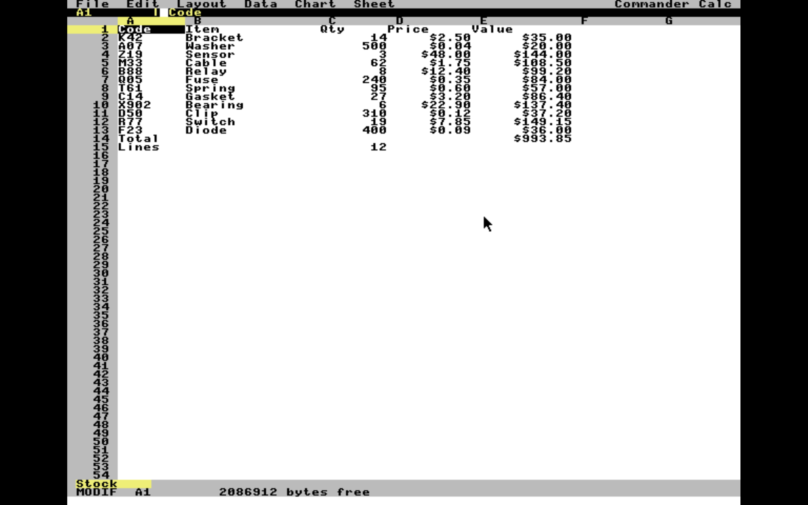

# Commander Calc

A spreadsheet for the [Commander X16](https://www.commanderx16.com/). It runs on a stock 512 KB machine at 8 MHz and loadsfrom an SD card.

It has support for formulas, multiple worksheets, block editing, sorting,
charting, and import and export of `.XLSX` and `.CSV` files. The XLSX support
runs on the machine itself — there is no host-side converter.



## Features

**Cells and formulas**

- 16 worksheets per workbook, 65,535 rows by 256 columns (A–IV)
- Numbers, text, booleans, dates, formulas and error values
- 14 functions: `SUM`, `AVERAGE`, `MIN`, `MAX`, `COUNT`, `IF`, `AND`, `OR`,
  `NOT`, `ABS`, `ROUND`, `INT`, `MOD`, `LEN`
- Arithmetic (`+ - * / ^`) and comparison (`= <> < <= > >=`) operators
- Absolute references with `$` — `$A$1`, `$A1` and `A$1` all behave as you
  would expect
- Cross-sheet references (`Q1!B5`)
- Circular references are detected and reported as `#CYCLE!` rather than
  producing a number
- Automatic or manual recalculation

**Editing**

- Block selection: `Ctrl+A` anchors, cursor movement extends it, and every
  movement key works — arrows, Page Up/Down, Home, End, mouse click
- Copy, paste, clear and sort all operate on the block
- Pasted formulas have their references rewritten by the block's offset, in
  both rows and columns, and column letters carry correctly (Z → AA)
- The same rewriting runs on insert row, delete row, sort and undo sort
- Insert and delete rows and columns
- Find and replace
- Single-level undo

**Formatting**

- 8 number formats: general, integer, decimal, currency, percent, date, time,
  text
- Bold, and left/right/centre alignment
- Column widths, 3 to 40 characters, up to 9 non-default widths per sheet
- Frozen headings

**Files**

- `.X16S` native format — chunked, CRC-32 checked, and about three times
  faster to load than the equivalent `.XLSX` 
- `.XLSX` import and export, including multiple sheets, shared and inline
  strings, number formats, column widths and formulas
- `.CSV` import and export (RFC 4180 quoting; reads LF, CR and CRLF)
- Saves are atomic: written to a temporary file, read back and verified
  before replacing the original, so an interrupted save leaves the previous
  workbook intact
- The Open dialog browses subdirectories, sorted, 64 entries a directory

**Charting**

- Bar, line and pie charts of the cursor's column, up to 16 values, labelled
  from the column to the left
- Drawn as VERA bitmap graphics, not character cells
- `S` saves the chart as `CHART.BMP` — 640×480, 16 colours, about 150K

## Limits

| | |
|---|---|
| Worksheets per workbook | 16 |
| Rows × columns | 65,535 × 256 |
| Cells per worksheet | 16,384 |
| Text strings per workbook | 8,192 |
| Cell styles | 128 |
| Non-default column widths per sheet | 9 |
| Formula source length | 255 characters |
| Values in one chart | 16 |
| Staged file during XLSX import | 128 KB |

Numbers are 40-bit Microsoft Binary Format floats, evaluated by the X16 ROM's
own math library — roughly 24 bits of usable precision, so integers above
about 16.7 million lose exactness.

## Requirements

- Commander X16 with 512 KB banked RAM. 2 MB is supported and worth having
  for large imports
- 80-column display
- SD card, or the host filesystem under the emulator
- A mouse is optional — every command is reachable from the keyboard

## Installation

Copy all 18 files — `CMDRCALC.PRG` and `OVL1.BIN` through `OVL17.BIN`, about
138K in total — into one directory of a CMDR-DOS-formatted card. They must all
be present, in the same place, on the same device.

```
LOAD"CMDRCALC.PRG",8
RUN
```

Under the emulator:

```
x16emu -rom rom.bin -fsroot . -prg CMDRCALC.PRG -run
```

## Commands

| Menu | Commands |
|---|---|
| **File** | New, Open, Save, Save as, Import, Export, Quit |
| **Edit** | Edit cell, Select, Copy, Paste, Undo, Clear, Find, Replace |
| **Layout** | Insert row, Delete row, Insert column, Delete column, Column width, Freeze |
| **Data** | Sort up, Sort down, Undo sort, Recalc now, Auto recalc |
| **Chart** | Bars, Line, Pie |
| **Sheet** | Next, Previous, Add, Rename, Delete |

Keys: `F1` new, `F2` edit cell, `F3` open, `F4` save, `F5` undo, `F6` save as,
`F7` import, `F8` export, `F9` quit, `F10` menu bar, `Ctrl+A` select,
`Ctrl+C` copy, `Ctrl+V` paste, `Ctrl+F` find, `Del` clear.

Everything on File and Edit has a key. Layout, Data, Chart and Sheet are
reached through the menu bar.

### A note on the emulator's own keys

x16emu claims several `Ctrl` combinations before the program sees them, two of
which Commander Calc uses:

| Key | The emulator does |
|-----|-------------------|
| `Ctrl+V` | Pastes the host clipboard by injecting keystrokes |
| `Ctrl+F` | Toggles full screen |
| `Ctrl+R` | Resets the machine |
| `Ctrl+S` | Writes a system dump |
| `Ctrl+M` | Toggles mouse capture |

Commander Calc sets `$9FB7`, the emulator's "leave the keys alone" flag, at
startup, so paste and find reach the program and the rest do not fire by
accident. On real hardware `$9FB0`–`$9FBF` is unused I/O, so the write is
harmless there.

`Ctrl+M` is the exception — the emulator intercepts it unconditionally, so it
always toggles mouse capture. If the pointer will not leave or enter the
window, that is the key.

## How it works

The X16 has 512 KB of banked RAM behind an 8 KB window, but only 32 KB of
directly addressable space for the program. The design follows from that:

- **The resident image is under 30 KB** and holds the grid, the workbook
  model, the menu bar and the overlay loader.
- **Everything else lives in one of 17 overlays**, each 7,936 bytes at
  `$8000`, loaded on demand: the formula compiler, the evaluator, the
  reference rewriter, the CSV layer, the ZIP reader, the DEFLATE decoder, the
  XLSX parsers and writers, the `.X16S` reader and writer, the file dialogs,
  the menus, the charting engine and the `.BMP` writer. Only one is resident
  at a time, and an overlay may not call another — `tools/check_overlays.py`
  enforces that at build time, because the failure mode is a hang rather than
  a link error.
- **Workbook data lives entirely in banked RAM**, addressed by handle rather
  than by pointer, so a bank switch can never invalidate a live reference.

Everything portable compiles for both cc65 and gcc and is unit-tested on the
host, which is the only practical way to debug a DEFLATE implementation on an
8 MHz 6502.

## Building

Requires the [cc65](https://cc65.github.io/) cross-development package.

```
make test          # host unit tests (gcc) — fast, run on every change
make               # CMDRCALC.PRG + OVL1..OVL17.BIN
make run           # launch in the emulator
make debug         # launch with the visual debugger
make manual        # build the reference manual
make env           # show the resolved toolchain paths
```

cc65 installed under a non-default prefix needs `CC65_HOME` set, or its
`.macpack`/`.include` lookups fail. The Makefile exports it itself.

## Documentation

`docs/manual` builds a reference manual covering every command, key, function
and message, and the byte layout of the native file format:

```
make manual        # build it     -> docs/manual/build/
make manualpdf     # and publish  -> docs/manual/pdf/
```

A built copy is committed at
[`docs/manual/pdf/commander-calc-manual.pdf`](docs/manual/pdf/commander-calc-manual.pdf),
so it can be read without a TeX installation.

## Layout

```
cfg/       linker config: resident core + overlay areas
src/
  platform/  banked RAM, overlays, file I/O, VERA, keyboard, mouse
  ui/        grid, menus, dialogs, editor, charts
  workbook/  cells, sheets, strings, styles, native format
  formula/   tokenizer, parser, bytecode, evaluator
  import/    csv, zip, inflate, xml, xlsx
  export/    xlsx, zip writer
  util/      numbers, dates, crc32, errors
tests/     host unit tests
tools/     python helpers for fixtures and checks
site/      project page
```

Filename suffixes drive the build: `*_x16.c` and `*_x16.s` are X16-only,
`*_host.c` is host-only, everything else builds for both.

---

Commander Calc is an independent program for the Commander X16, not affiliated
with or derived from any commercial spreadsheet.
